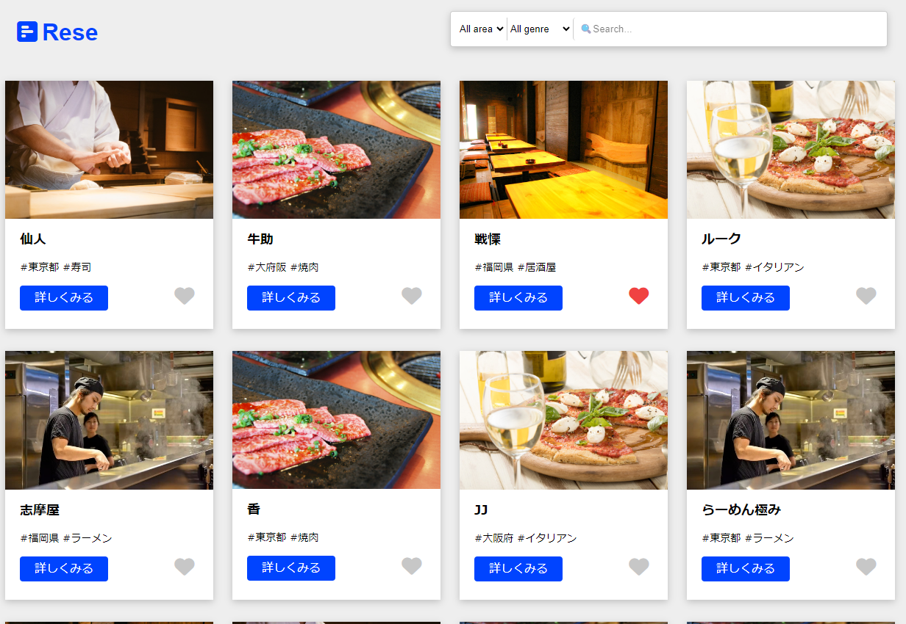
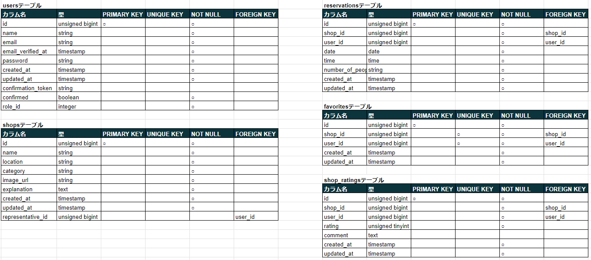
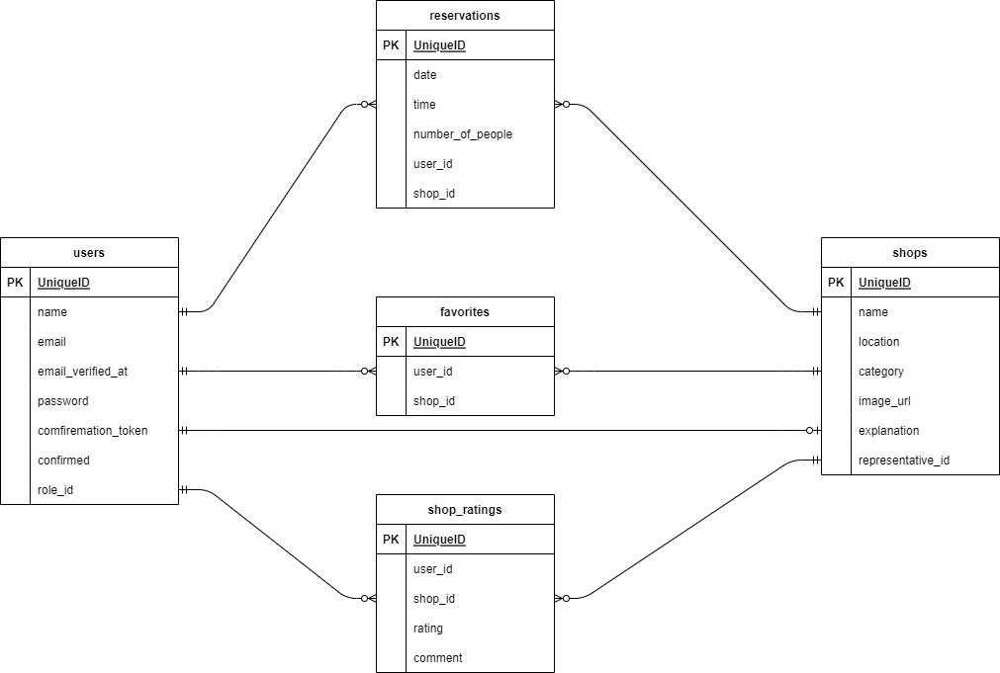

# Rese
店舗予約アプリケーション

## 作成した目的
お客様と店舗の間で円滑に、かつ正確に予約が出来るようにするため。

## アプリケーションURL
http://13.114.159.167/login

## 機能一覧
- 会員登録
- ログイン
- ログアウト
- ユーザー情報取得
- ユーザー飲食店お気に入り一覧取得
- ユーザー飲食店予約情報取得
- 飲食店一覧取得
- 飲食店詳細取得
- 飲食店お気に入り追加
- 飲食店お気に入り削除
- 飲食店予約情報追加
- 飲食店予約情報削除
- エリアで検索する
- ジャンルで検索する
- 店名で検索する

## 使用技術(実行環境)
- Laravel 8.83.27
- PHP 8.1
- mysql 8.0.26

## テーブル設計

## ER図

# 環境構築# Rese
$ git clone git@github.com:fujita-ryouhei/Rese.git

続いてDockerの設定を行なっていきます。以下のコマンドを入力してください。 
$ docker-compose up -d --build 
実行が終わったら、「Docker Desktop for Mac」を確認して、コンテナが作成されていれば成功です。  

次にdocker-composeコマンドで PHPコンテナ内にログインしましょう。 
docker-compose exec php bash  
ログインができたら、composerコマンドを使って必要なパッケージをインストールします。 
composer install  

最後に、データベースに接続するために.envファイルを作成します。 
.envファイルは、.env.exampleファイルをコピーして作成しましょう。 
$ cp .env.example .env 
作成出来たら、.envファイルを以下のように編集します。  
.envファイル  
// 前略  
DB_CONNECTION=mysql 
DB_HOST=mysql 
DB_PORT=3306 
DB_DATABASE=laravel_db 
DB_USERNAME=laravel_user 
DB_PASSWORD=laravel_pass  
// 後略  

以下のアドレスに入るとデータベースが存在しているか確認ができます。

http://localhost:8080/ 

確認出来たらマイグレーションをします。 
php artisan migrate  
最後にシーディングをします。 
php artisan db:seed 

以上で環境構築は完了です。  